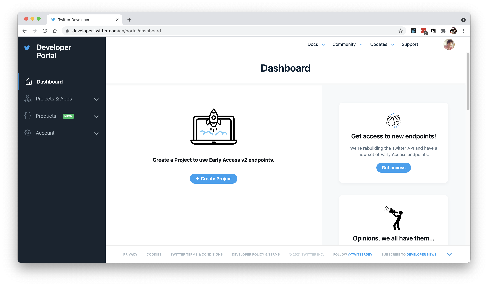
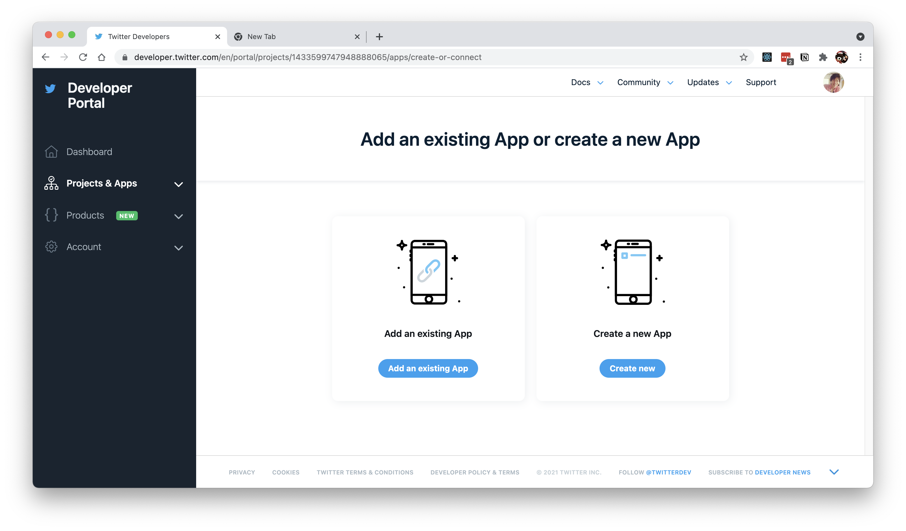
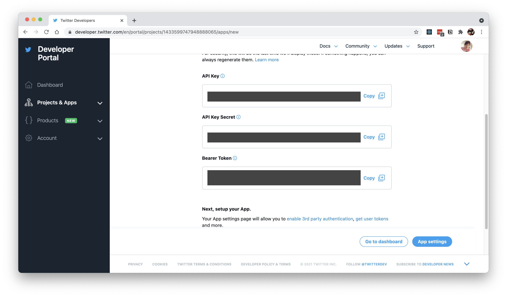

# twitter-stream-to-websocket
twitterのタイムラインをキーワードや投稿者で絞り込み、ライブでWebsocketに送信するサービスをherokuに立ち上げます
# 必要なもの
- herokuのアカウント
- twitterの開発者アカウント
- twitter連携アプリ

それぞれのアカウントの作り方は以下の通りです
## herokuアカウント
https://signup.heroku.com/jp から作成してください

## twitterの開発者アカウント
https://developer.twitter.com/en/portal/dashboard にアクセスして開発用のtwitterアカウントでログインします

個人利用と同じでよければいつものtwitterアカウントと同じで問題ありません
twitterアカウントを持っていない場合は作成してください

## twitter連携アプリ
https://developer.twitter.com/en/portal/dashboard にアクセスします

「+ Create Project」ボタンを押します


4枚のウィザードが表示されるので、最初の3枚はそれぞれ以下のように入力してください

ウィザード|入力内容
--------|-------
1 Project Name | 適当な名前（例: TwitterStreamSample)
2 Use case | 該当するもの(`Doing academic research` か `student`）のどちらかになる場合が多いかなと思います
3 Project description | 利用目的（例: Create an application that broadcasts tweets containing specific content in real time via websocket.）

ウィザードの4枚目はプロジェクト紐付けるアプリを設定します


画面右側の「Create new」を押してください

アプリ名の入力フォームが表示されます。世界で一意な名前にする必要があるので、単語や数字を混ぜでエラーにならない名前を入力してください

名前を登録すると、APIを実行するための秘匿情報が3つ表示されます

この中の「Bearer Token」を控えておいてください。

# 作成手順
1. 以下のボタンを押してアプリ作成フォームを表示します

[](https://heroku.com/deploy)


「App name」に一意な名前を入力し、「TWITTER_BEARER_TOKEN」に先ほど控えた「Bearer Token」を入力してください

入力できたら「Deploy app」ボタンを押します
アプリの作成までしばらく待ちます

2. リアルタイムに取得したいtweetの検索条件を設定します
cURLというコマンドを使って設定します

> 以下macにインストールされているターミナルというアプリケーションを使って入力するコマンドを記載しています。初めて使う方は以下を見たり、使い方を検索してみてください。

[Macで「ターミナル」を開く/終了する](https://support.apple.com/ja-jp/guide/terminal/apd5265185d-f365-44cb-8b09-71a064a42125/mac)

## リアルタイムに取得したいtweetの検索条件設定
### BEARER_TOKENを設定
毎回BEARER_TOKENを入力するのは手間なので、変数に設定しておくと楽です。
```
export BEARER_TOKEN={控えておいたBEARER_TOKEN}
```
### 検索条件の登録
以下のような感じで、`#ttrealtime`のところを検索条件にします。文字列、ハッシュタグ、その他ツイートした人など検索することができます。

検索条件は複数設定することができ、それぞれラベル（`tag`）をつけておくことができます。

検索条件に入力できる条件はこちらに詳しい説明があるので、必要に応じてご確認ください。
https://developer.twitter.com/en/docs/twitter-api/tweets/filtered-stream/integrate/build-a-rule
```
curl -X POST 'https://api.twitter.com/2/tweets/search/stream/rules' \
-H "Content-type: application/json" \
-H "Authorization: Bearer $BEARER_TOKEN" -d \
'{
  "add": [
    {"value": "#ttrealtime" , "tag": "realtimesample"},
    {"value": "#ttrealtime2" , "tag": "realtimesample2"}
 ]
}'
```

### 検索条件の確認
```
curl 'https://api.twitter.com/2/tweets/search/stream/rules' \
-H "Content-type: application/json" \
-H "Authorization: Bearer $BEARER_TOKEN"
``` 
